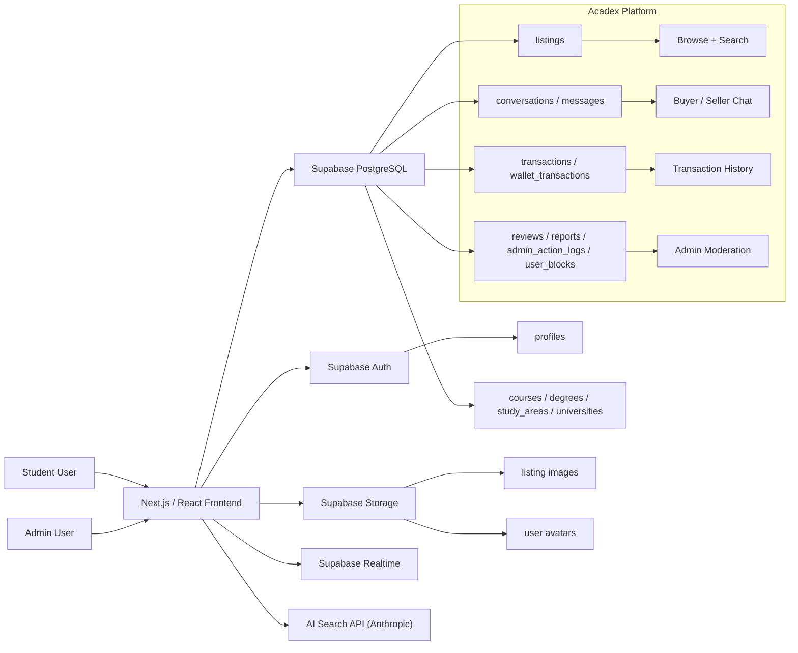
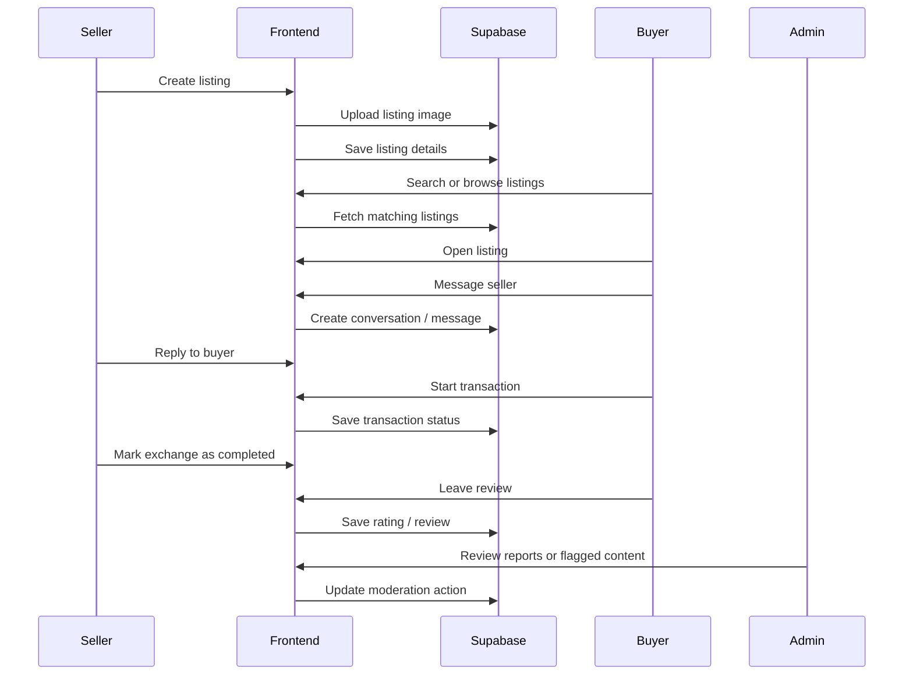
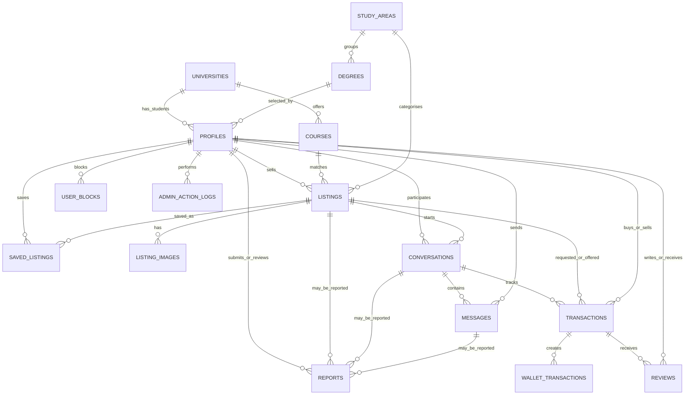
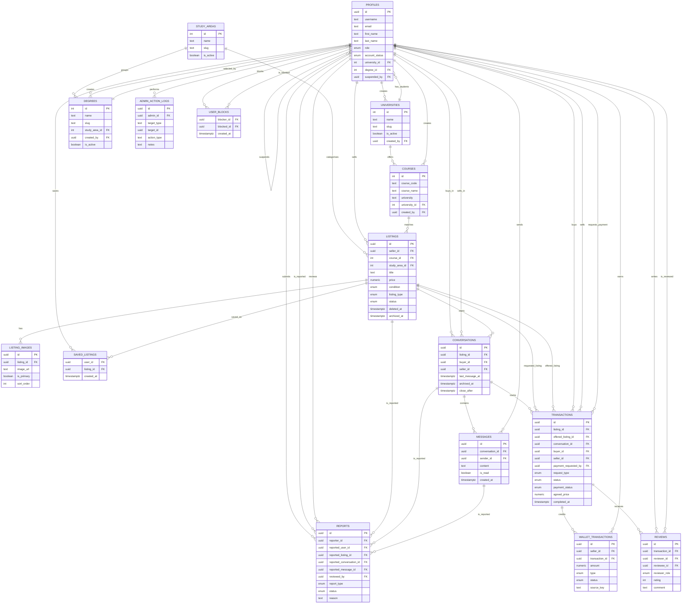

# Acadex

Acadex is a student-focused peer-to-peer book exchange platform for buying,
selling, and exchanging textbooks and academic materials within a university
community.

The app is designed to help students discover relevant course materials, create
listings, communicate with other users, and manage transactions in a safer and
more structured environment than generic marketplace platforms.

The current app is built with:

- Next.js
- React + TypeScript
- Tailwind CSS
- Supabase Auth
- Supabase PostgreSQL
- Supabase Storage
- Supabase Row Level Security
- Supabase Realtime
- Stripe Checkout test payments
- AI-assisted listing search

## Current MVP

The repo currently supports:

- email/password authentication
- student user profiles
- listing creation for textbooks and academic materials
- listing images through Supabase Storage
- browsing listings by course, study area, condition, and availability
- keyword-based search and filtering
- AI-assisted search for more natural listing discovery
- saved listings / wishlist functionality
- in-app messaging between buyers and sellers
- transaction and exchange status tracking
- Stripe checkout for paid sale transactions
- seller wallet activity tracking for demo payments
- rating and review functionality
- user blocking and reporting
- admin moderation tools for listings, users, and reports
- light and dark mode support
- responsive layouts for desktop and mobile

The MVP is focused on validating the core exchange workflow: students can list
academic materials, discover relevant listings, contact each other, and complete
or manage transactions through the platform.

## Core Flow

1. Sign up or sign in.
2. Complete or update the user profile.
3. Browse available listings.
4. Search or filter by keyword, course, subject, price, condition, or availability.
5. Open a listing to view item details and seller information.
6. Message the seller to ask questions or negotiate.
7. Start or update the transaction status.
8. Complete the exchange.
9. Leave a rating or review.
10. Report problematic users or listings when needed.

Admins can review platform activity through the moderation panel and act on
reported users, inappropriate listings, and other flagged content.

## Architecture

Acadex uses a Next.js frontend with Supabase as the backend platform. The
frontend handles routing, page rendering, forms, listing views, search interfaces,
messaging screens, and admin dashboards. Supabase provides authentication,
database storage, file storage, realtime messaging support, and row-level access
control.



## Listing + Transaction Sequence



## Main Features

### Listings System

Students can create listings for textbooks and academic materials. A listing can
include:

- title
- author
- edition
- ISBN number
- publisher
- description
- price
- condition
- listing type (for sale, trade or sale, trade only)
- course
- study area
- availability status
- listing images

Listings are connected to academic metadata so users can find items that are
relevant to their university, degree, course, or study area.

### Search and Filtering

Acadex supports both standard search and AI-assisted search.

Standard search allows users to search and filter by:

- title or author (key words)
- course
- study area
- price range
- item condition
- university
- listing type (sale, trade, sale or trade)

AI-assisted search is intended to support more natural queries, such as searching
for materials related to a course, topic, or academic need even when the wording
does not exactly match the listing title.

### Messaging System

The messaging system allows buyers and sellers to communicate inside the
platform before arranging an exchange.

The system supports:

- buyer/seller conversations
- listing-specific enquiries
- message history
- realtime message updates
- blocking and safety restrictions where applicable

### Transaction History

Users can track their activity through listing and transaction history.

This includes:

- active listings
- previous listings
- ongoing transactions
- completed transactions
- cancelled or inactive transactions
- review eligibility after completed or accepted-cancelled transactions

### Admin Moderation

Admins can access moderation tools for managing platform safety and content
quality.

The admin system supports:

- admin-only access controls
- listing review and removal
- user report review
- inappropriate content management
- admin action logging
- moderation-related status updates

## Database Overview

Acadex uses Supabase PostgreSQL as the main database. Core tables include:

- `profiles`
- `listings`
- `listing_images`
- `universities`
- `degrees`
- `study_areas`
- `courses`
- `conversations`
- `messages`
- `transactions`
- `wallet_transactions`
- `reviews`
- `reports`
- `admin_action_logs`
- `user_blocks`
- `saved_listings`

Reference tables such as `universities`, `degrees`, `study_areas`, and `courses`
are used to keep academic categorisation consistent across the platform.

Row Level Security policies are used to control access to user data, listings,
messages, reports, admin tools, and other protected records.

## Entity Relationship Diagram

The platform schema is centred on `profiles`, `listings`, messaging,
transactions, reviews, reports, academic reference data, and demo wallet records.

### Simplified ERD

This view shows the main platform areas and their highest-level relationships.



In the simplified diagram, `profiles` represents the people using the platform:
students, sellers, buyers, and admins. Profiles create `listings`, save listings
through `saved_listings`, participate in `conversations`, send `messages`, buy
or sell through `transactions`, write or receive `reviews`, submit or review
`reports`, block other users through `user_blocks`, and perform moderation
actions recorded in `admin_action_logs`.

Academic reference data is kept separate from marketplace activity.
`universities`, `courses`, `study_areas`, and `degrees` describe where students
study and how listings are categorised. Marketplace activity then connects those
profiles and reference records to listing images, conversations, transaction
status, Stripe-backed demo wallet records, reviews, reports, and safety actions.

### Detailed ERD



The detailed diagram expands the simplified view into the main tables and key
foreign-key fields. `PK` marks a primary key, and `FK` marks a reference to
another table.

- `profiles` is the central user table. It stores identity, role, account
  status, academic profile links, avatar metadata, and suspension details.
- `universities`, `study_areas`, `degrees`, and `courses` are reference tables
  used to keep student profiles and listing categories consistent.
- `listings`, `listing_images`, and `saved_listings` make up the marketplace
  catalogue: sellers own listings, listings can have images, and users can save
  listings to a wishlist.
- `conversations` and `messages` support buyer-seller chat. A conversation is
  tied to a listing and has buyer and seller profile references; messages belong
  to that conversation and record the sender.
- `transactions` records buy or trade requests, reservation status, payment
  status, completion state, and links back to the buyer, seller, listing,
  optional offered trade listing, and conversation.
- `wallet_transactions` records demo seller earnings and withdrawals that are
  created from completed Stripe checkout flows.
- `reviews` links completed transaction feedback to the reviewer and the user
  being reviewed.
- `reports`, `admin_action_logs`, and `user_blocks` cover safety and moderation:
  users can report profiles, listings, conversations, or messages; admins can
  review reports and log moderation actions; users can block other profiles.

## Running the Platform

Acadex can be reviewed through the deployed Vercel site or by running the
project locally.

### Deployed Version

The deployed platform is available at:

```bash
https://acadex-lilac.vercel.app
```

No local setup is required to use the deployed version.

### Local Development

To run the platform locally against the already configured backend:

1. Install dependencies:

```bash
npm install
```

2. Create `.env.local` in the project root and insert the environment variable
   values from the final report document:

```bash
NEXT_PUBLIC_SUPABASE_URL=
NEXT_PUBLIC_SUPABASE_PUBLISHABLE_KEY=
SUPABASE_SERVICE_ROLE_KEY=
ANTHROPIC_API_KEY=
STRIPE_SECRET_KEY=
STRIPE_WEBHOOK_SECRET=
```

The public Supabase URL and publishable key are used by the frontend client. The
service role key, Anthropic key, and Stripe secrets should only be used in secure
server-side contexts and must not be exposed to the browser.

3. Start the development server:

```bash
npm run dev
```

The app should then be available at:

```bash
http://localhost:3000
```

### Backend Configuration

The Supabase backend, database schema, Row Level Security policies, storage
buckets, authentication settings, and production Vercel environment variables
have already been configured for the submitted project. A new Supabase project
does not need to be created for normal review or local testing.

## Verification

Run the linter:

```bash
npm run lint
```

Run type checking:

```bash
npx tsc --noEmit
```

Run tests:

```bash
npm run test
```

Create a production build:

```bash
npm run build
```

## Notes

Acadex is built as a university project and is currently focused on demonstrating
a complete peer-to-peer academic material exchange workflow. The platform should
be reviewed carefully before production use, especially around authentication,
Row Level Security, storage policies, admin permissions, messaging privacy, and
data retention.
