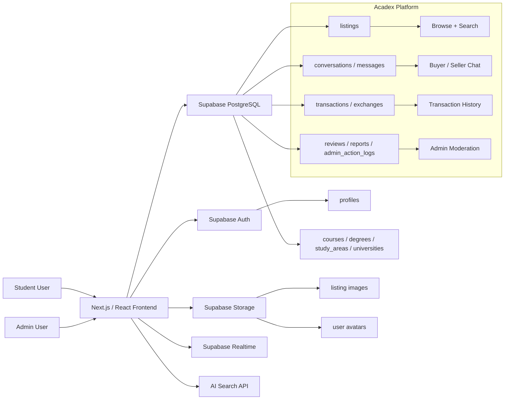
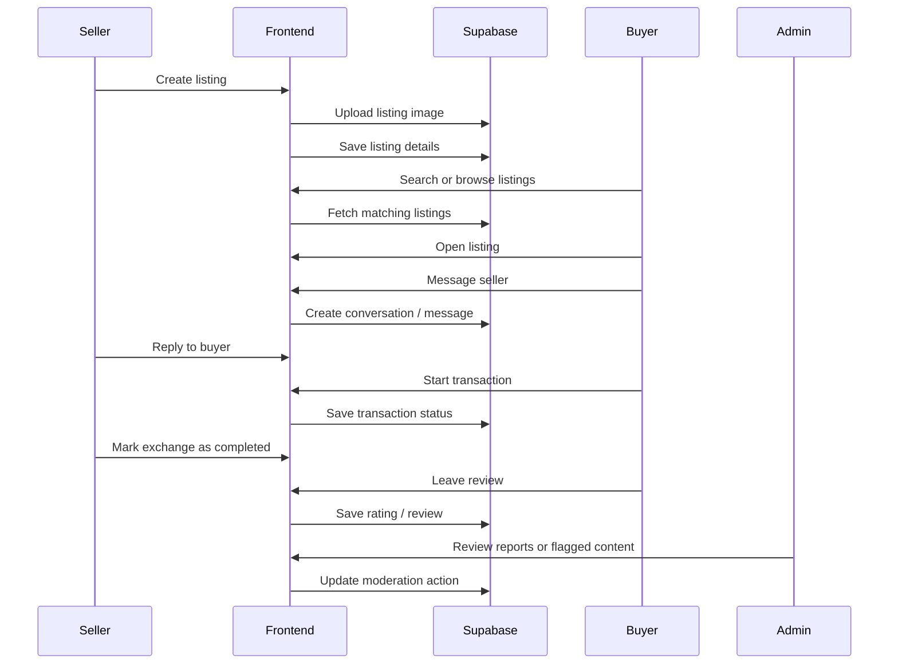

# Acadex

Acadex is a student-focused peer-to-peer book exchange platform for buying,
selling, and exchanging textbooks and academic materials within a university
community.

The app is designed to help students discover relevant course materials, create
listings, communicate with other users, and manage transactions in a safer and
more structured environment than generic marketplace platforms.

The current app is built with:

- Next.js
- React + TypeScript
- Tailwind CSS
- Supabase Auth
- Supabase PostgreSQL
- Supabase Storage
- Supabase Row Level Security
- Supabase Realtime
- AI-assisted listing search

## Current MVP

The repo currently supports:

- email/password authentication
- student user profiles
- listing creation for textbooks and academic materials
- listing images through Supabase Storage
- browsing listings by course, study area, condition, and availability
- keyword-based search and filtering
- AI-assisted search for more natural listing discovery
- saved listings / wishlist functionality
- in-app messaging between buyers and sellers
- transaction and exchange status tracking
- rating and review functionality
- user blocking and reporting
- admin moderation tools for listings, users, and reports
- light and dark mode support
- responsive layouts for desktop and mobile

The MVP is focused on validating the core exchange workflow: students can list
academic materials, discover relevant listings, contact each other, and complete
or manage exchanges through the platform.

## Core Flow

1. Sign up or sign in.
2. Complete or update the user profile.
3. Browse available listings.
4. Search or filter by keyword, course, subject, price, condition, or availability.
5. Open a listing to view item details and seller information.
6. Message the seller to ask questions or negotiate.
7. Start or update the transaction status.
8. Complete the exchange.
9. Leave a rating or review.
10. Report problematic users or listings when needed.

Admins can review platform activity through the moderation panel and act on
reported users, inappropriate listings, and other flagged content.

## Architecture

Acadex uses a Next.js frontend with Supabase as the backend platform. The
frontend handles routing, page rendering, forms, listing views, search interfaces,
messaging screens, and admin dashboards. Supabase provides authentication,
database storage, file storage, realtime messaging support, and row-level access
control.



## Listing + Transaction Sequence



## Main Features

### Listings System

Students can create listings for textbooks and academic materials. A listing can
include:

- title
- description
- price
- condition
- material type
- course
- study area
- availability status
- listing images

Listings are connected to academic metadata so users can find items that are
relevant to their university, degree, course, or study area.

### Search and Filtering

Acadex supports both standard search and AI-assisted search.

Standard search allows users to search and filter by:

- keyword
- course
- study area
- price range
- item condition
- listing availability

AI-assisted search is intended to support more natural queries, such as searching
for materials related to a course, topic, or academic need even when the wording
does not exactly match the listing title.

### Messaging System

The messaging system allows buyers and sellers to communicate inside the
platform before arranging an exchange.

The system supports:

- buyer/seller conversations
- listing-specific enquiries
- message history
- realtime message updates
- blocking and safety restrictions where applicable

### Transaction History

Users can track their activity through listing and transaction history.

This includes:

- active listings
- previous listings
- ongoing exchanges
- completed transactions
- cancelled or inactive exchanges
- review eligibility after completed transactions

### Admin Moderation

Admins can access moderation tools for managing platform safety and content
quality.

The admin system supports:

- admin-only access controls
- listing review and removal
- user report review
- inappropriate content management
- admin action logging
- moderation-related status updates

## Database Overview

Acadex uses Supabase PostgreSQL as the main database. Core tables include:

- `profiles`
- `listings`
- `listing_images`
- `universities`
- `degrees`
- `study_areas`
- `courses`
- `conversations`
- `messages`
- `transactions` / `exchanges`
- `reviews`
- `reports`
- `admin_action_logs`
- `blocked_users`
- `saved_listings`

Reference tables such as `universities`, `degrees`, `study_areas`, and `courses`
are used to keep academic categorisation consistent across the platform.

Row Level Security policies are used to control access to user data, listings,
messages, reports, admin tools, and other protected records.

## Local Development

1. Install dependencies:

```bash
pnpm install
```

2. Create a local environment file:

```bash
cp .env.example .env.local
```

Set the required values in `.env.local`:

```bash
NEXT_PUBLIC_SUPABASE_URL=
NEXT_PUBLIC_SUPABASE_ANON_KEY=
SUPABASE_SERVICE_ROLE_KEY=
```

Depending on the enabled features, the project may also require:

```bash
OPENAI_API_KEY=
NEXT_PUBLIC_SITE_URL=
```

The public Supabase URL and anon key are used by the frontend client. The service
role key should only be used in secure server-side contexts and must not be
exposed to the browser.

3. Start the development server:

```bash
pnpm run dev
```

The app should then be available at:

```bash
http://localhost:3000
```

## Supabase Setup

Before running the app, create or connect a Supabase project and configure:

- authentication providers
- database tables
- row-level security policies
- storage buckets
- storage access policies
- realtime settings where required
- database functions and triggers where required

Expected storage buckets may include:

- `avatars`
- `listing-images`

Make sure the storage policies match the intended access rules. Public read
access may be appropriate for listing images, but write access should be limited
to authenticated users and ownership-aware policies.

## Database Workflow

If the project uses Supabase migrations, apply them through the Supabase CLI:

```bash
supabase db push
```

To pull the remote database schema into local migrations:

```bash
supabase db pull
```

To reset a local Supabase database:

```bash
supabase db reset
```

Reference data such as universities, degrees, study areas, and courses should be
seeded before testing listing creation and search flows.

## Demo Data

For demo or testing purposes, create sample data for:

- users
- profiles
- listings
- listing images
- conversations
- messages
- transactions
- reports
- reviews

Demo listings should cover multiple study areas and courses so that search,
filtering, recommendations, and category pages can be tested properly.

Do not use real student data in demo environments.

## Verification

Run the linter:

```bash
pnpm run lint
```

Run type checking:

```bash
pnpm run typecheck
```

Run tests:

```bash
pnpm run test
```

Create a production build:

```bash
pnpm run build
```

## Deployment

Acadex can be deployed to Vercel or another Next.js-compatible hosting provider.

Before deploying, configure the production environment variables:

```bash
NEXT_PUBLIC_SUPABASE_URL=
NEXT_PUBLIC_SUPABASE_ANON_KEY=
SUPABASE_SERVICE_ROLE_KEY=
OPENAI_API_KEY=
NEXT_PUBLIC_SITE_URL=
```

In Supabase, also confirm that the deployed site URL is added to the allowed
authentication redirect URLs.

## Notes

Acadex is built as a university project and is currently focused on demonstrating
a complete peer-to-peer academic material exchange workflow. The platform should
be reviewed carefully before production use, especially around authentication,
Row Level Security, storage policies, admin permissions, messaging privacy, and
data retention.